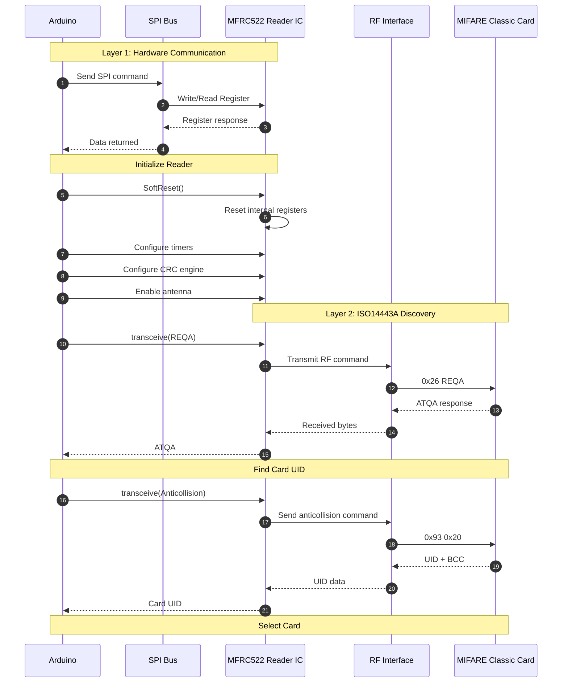

# Unfinished

```mermaid
sequenceDiagram
    autonumber

    
    participant A as Arduino
    participant S as SPI Bus
    participant R as MFRC522 Reader IC
    participant F as RF Interface
    participant C as MIFARE Classic Card

    Note over A,R: Layer 1: Hardware Communication

    A->>S: Send SPI command
    S->>R: Write/Read Register

    R-->>S: Register response
    S-->>A: Data returned


    Note over A,R: Initialize Reader

    A->>R: SoftReset()
    R->>R: Reset internal registers

    A->>R: Configure timers
    A->>R: Configure CRC engine
    A->>R: Enable antenna


    Note over R,C: Layer 2: ISO14443A Discovery

    A->>R: transceive(REQA)
    R->>F: Transmit RF command
    F->>C: 0x26 REQA

    C-->>F: ATQA response
    F-->>R: Received bytes
    R-->>A: ATQA


    Note over A,C: Find Card UID

    A->>R: transceive(Anticollision)

    R->>F: Send anticollision command
    F->>C: 0x93 0x20

    C-->>F: UID + BCC
    F-->>R: UID data
    R-->>A: Card UID


    Note over A,C: Select Card

  
```