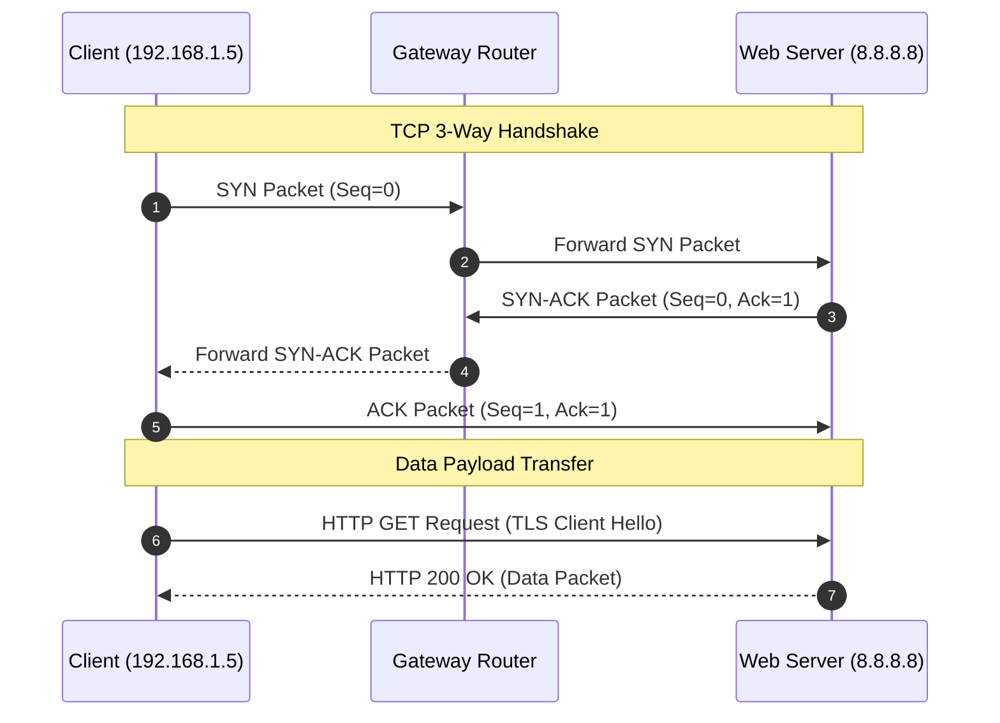

```mermaid
sequenceDiagram
    autonumber
    participant PC as Client (192.168.1.5)
    participant Router as Gateway Router
    participant Server as Web Server (8.8.8.8)

    Note over PC, Server: TCP 3-Way Handshake
    PC->>Router: SYN Packet (Seq=0)
    Router->>Server: Forward SYN Packet
    Server->>Router: SYN-ACK Packet (Seq=0, Ack=1)
    Router-->>PC: Forward SYN-ACK Packet
    PC->>Server: ACK Packet (Seq=1, Ack=1)

    Note over PC, Server: Data Payload Transfer
    PC->>Server: HTTP GET Request (TLS Client Hello)
    Server-->>PC: HTTP 200 OK (Data Packet)
```

